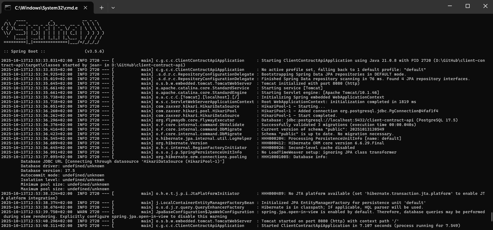
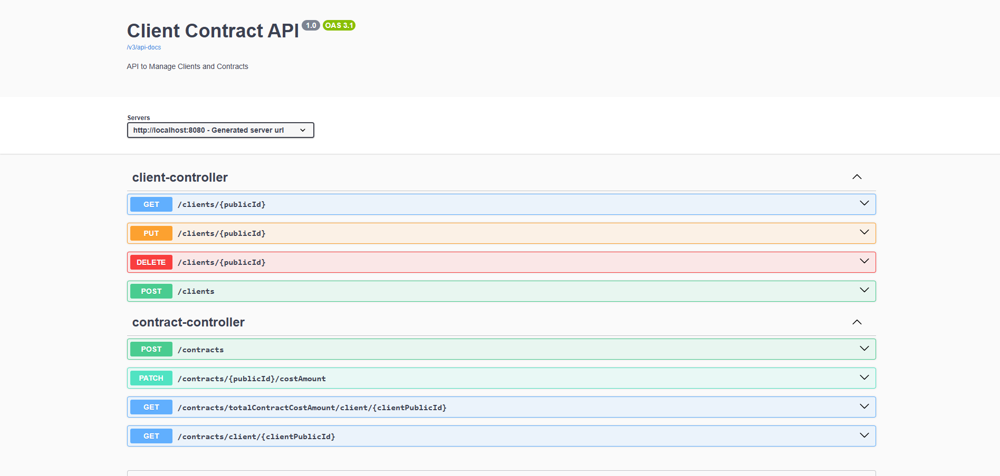

# Client Contract API

An API using the factory design pattern in Java Spring Boot to manage clients and contracts.

## API Architecture & Design Explanation

- The API is fully implemented and validated, following REST principles and returning standardized JSON responses. 
- The project uses a clean layered architecture (controller, service, repository, dto, model, transformer) to separate concerns and ensure maintainability.
- Entities extend a common BaseEntity to handle creation, update, and soft deletion consistently.
- A combination of ID (auto-increment) and publicId (UUID) provides internal efficiency and external stability for distributed systems.
- Client is abstract, with PersonClient and CompanyClient extending it through JPA inheritance (JOINED strategy).
- DTOs are used to control exposed data (e.g. contract updated field hidden).
- PostgreSQL is used as the database, with Flyway ensuring schema consistency and persistence across restarts.

All timestamps follow ISO 8601, and validation is applied to dates, emails, and phone numbers.

## Backend

- **Technology:** Java 21 (OpenJDK 21.0.8), Spring Boot with Maven
- **Database:** PostgreSQL 17.5 (`client-contract-api`) with user `postgres` and password `password`
- **Database Migrations:** Flyway
- **Code Utilities:** Lombok for cleaner code
- **Data Access:** Spring JPA

## Features

#### Client Management

- Create clients of two types:
  - **PersonClient** with name, email, phone, and birthdate.
  - **CompanyClient** with name, email, phone, and a unique companyIdentifier (e.g., aaa-123).
- Retrieve client details, returning all relevant fields.
- Update client information (all fields except birthdate and companyIdentifier).
- Soft-delete clients — when deleted, all their active contracts are automatically closed by setting the endDate to the current date.

#### Contract Management

- Create contracts for a client, with:
  - **startDate** (defaults to current date if missing).
  - Optional **endDate** (null if ongoing).
  - **costAmount** (mandatory).
  - Internal **updated** timestamp automatically managed and hidden from API responses.
- Update contract costAmount, automatically refreshing the updated timestamp.
- Retrieve all active contracts for a client (current date < end date).
- Filter contracts by their last updated date.
- Includes a high-performance endpoint that returns the total sum of all active contracts for a given client.

## Installation

### Prerequisites

- Java 21 SDK
- PostgreSQL 17.5
- Docker (To run PostgreSQL)

### PostgreSQL Setup

#### Run PostgreSQL via Docker

```bash
docker run --name client-contract-api -e POSTGRES_DB=client-contract-api -e POSTGRES_USER=postgres -e POSTGRES_PASSWORD=password -p 5432:5432 -d postgres:17.5
```

## Backend Setup (Java 21 + Maven)

### Prerequisites

- **Java 21** installed  
  Download from the official Oracle website:  
  [https://www.oracle.com/java/technologies/downloads/#jdk21-windows](https://www.oracle.com/java/technologies/downloads/#jdk21-windows)

- **Set the `JAVA_HOME` environment variable**:

    1. Locate your Java installation folder, e.g.:
       ```
       C:\Program Files\Java\jdk-21
       ```
    2. Press **Win + S**, type **environment variables**, and click **Edit the system environment variables**.
    3. Click **Environment Variables…**.
    4. Under **System variables**, click **New…** (if it doesn’t exist) or **Edit** (if it exists):
        - **Variable name:** `JAVA_HOME`
        - **Variable value:** Java installation path (e.g., `C:\Program Files\Java\jdk-21`, but if you're having issues try with `C:\Progra~1\Java\jdk-21` to avoid white spaces)
    5. Edit the `Path` variable (under **System variables**) → **New** → add:
       ```
       %JAVA_HOME%\bin
       ```
    6. Click **OK** on all windows.

  **Verify installation:**

  ```cmd
  java -version
  javac -version
  echo %JAVA_HOME%
  ```

- Docker running locally (you can also run this PostgreSQL without Docker).

#### 1. Navigate to the backend folder (cloned project folder)

```bash
cd backend
```

#### 2. Build the project

Using Maven Wrapper (no need to install Maven globally):

**Windows:**

```cmd
mvnw.cmd clean install
```

**macOS/Linux:**

```bash
./mvnw clean install
```

#### 3. Run the backend

Windows:

```cmd
mvnw.cmd spring-boot:run
```

macOS/Linux:

```bash
./mvnw spring-boot:run
```

The backend will start at:
http://localhost:8080

#### 4. Configure the Database (if needed)

Database settings are located in:

```css
src/main/resources/application.yml
```

Update these values to match your local database configuration, if needed.

## 🚀 How to Use the API



The easiest way to explore and interact with this API is through the **integrated Swagger UI**, available at:

👉 **[http://localhost:8080/swagger-ui/index.html](http://localhost:8080/swagger-ui/index.html)**

Once the application is running, open this URL in your browser to access a fully interactive API documentation interface.

### 🧭 What You Can Do in Swagger UI

- Browse all available **endpoints**, grouped by controller or resource.
- View detailed **descriptions**, **request/response examples**, and **data schemas** (including field types, constraints, and nested objects).
- Try out requests directly from the browser — no need for an external client like Postman.
- Inspect **response codes** and payloads in real time.



### 🧰 Alternative: Using Postman (Optional)

If you prefer using **Postman** or another REST client:

1. Start the Spring Boot application.
2. Make requests to `http://localhost:8080/api/...` (adjusting for the endpoints).
3. Use JSON payloads as shown in the Swagger examples.
4. Add appropriate headers such as:

   ```http
   Content-Type: application/json
   Accept: application/json
   ```
